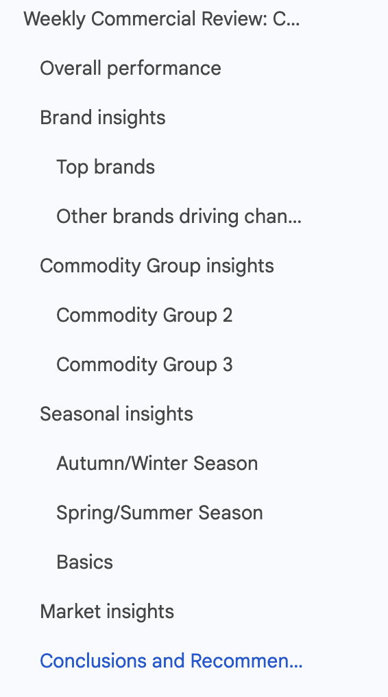
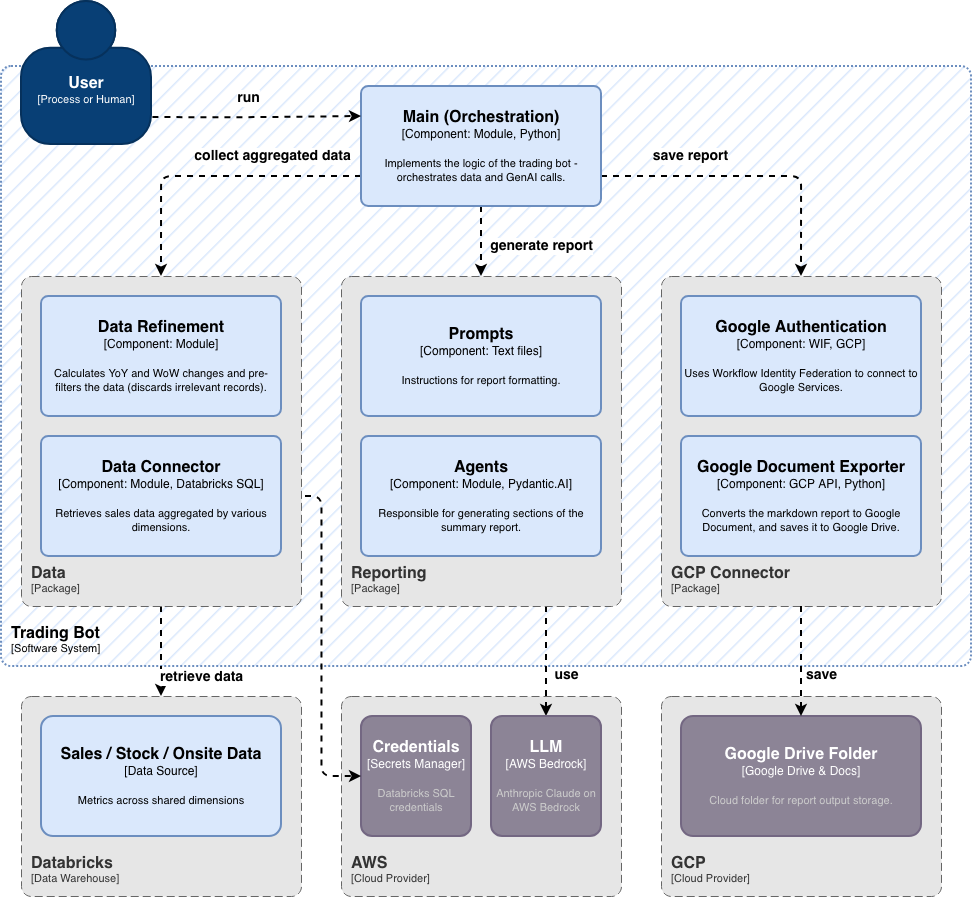
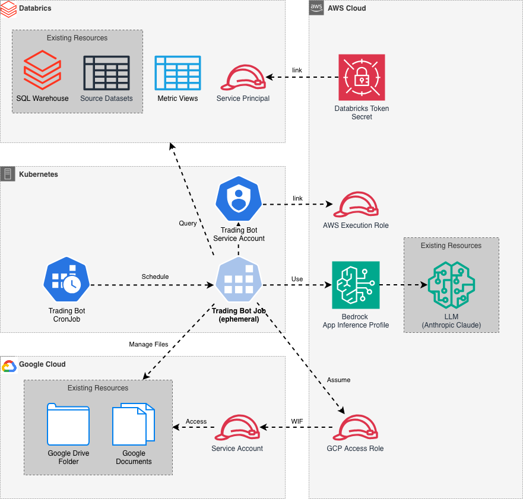

<!-- _class: cover -->

# Feeding GenAI
## Semantic Layer, Serialization and Other Tricks

Lessons from building a retail market analytics platform

---

# Key Topics

- **Business Context** — What are we building?
<br>
- **Semantic Layer** — How to deal with business metrics?
- **Serialization** — Passing Data to the LLM
- **Report Structure** — Moving Insights Ahead
<br>
- **Architecture** — Let's see some diagrams

<!--
This talk explores three practical problems encountered in production: 

- keeping complex business metric definitions consistent across a growing number of applications;
- efficiently passing large volumes of structured data to an LLM without wasting its attention budget on formatting overhead;
- and controlling the structure and order of a generated report without sacrificing the quality of its insights.
-->

---

<!-- _class: section-header -->

<span class="number">01</span>

# Business Context

## Create Hundreds of Weekly Trade Reports

- Gather Data from Various Sources
- Compare with Previous Week, Previous Year
- Drill Down into Various Aspects (Dimensions)
- Generate Insights

<div class="demo-label">Demo</div>

---

<!-- _class: section-header -->

<span class="number">02</span>

# Semantic Layer

Define business metrics once, use everywhere

---

# Data Sources

One report, three data sources

| Data Source | Dimensions | Metrics |
|---|---|---|
| **Sales**  | Shared (*) | GMV (Gross Merchandise Value), TDR (Total Discount Rate), ... |
| **Stock**  | Shared (*) | Stock Value, Stock Quantity, ... |
| **Onsite** | Shared (*) | Page Views, Conversion Rate, ... |

- **Shared dimensions:** Org Unit levels, Country, Brand, Season, Commodity Group levels, ...
- **Business metrics** in each data source.
- **Hundreds of reports** are generated for various Org Units, 
each drills down into many dimensions and combinations of dimensions.

<!--
The application needs to aggregate business metrics across several dimensions. The traditional method is
to write custom SQL queries that contain the expressions associated with each metric.

The solution is brittle, and metric definitions can diverge between different applications.
-->

---

# Business Metrics can be complex

<div class="columns">

<div>

```sql
SELECT
  brand_name,
  SUM(gmv_aft_ret_provision) AS gmv,
  ---- Beginning of TDR ---
  SUM(
    nmv_discount_market_aret_provision
    + nmv_discount_risk_aret_provision
    + nmv_coupon_aret_provision
  ) filter (where partner_flag = 0) 
  / 
  NULLIF(
    SUM(nmv_bdisc_aret_provision) 
    filter (where partner_flag = 0)
  , 0) * 100 AS tdr
  ---- End of TDR ---
FROM
  sales_data
WHERE
  order_date BETWEEN '2025-05-04' and '2026-05-10'
  AND unit = 'Unit 1'
GROUP BY ALL
```

</div>

<div>

- Cannot put them in views => custom SQL per query, per application
- Metric definitions **diverge** between apps over time
- A logic change must be replicated everywhere

> Fragile and expensive to maintain

</div>

</div>

---

# Define Once, Use Everywhere

<div class="columns">

<div>

Databricks **Metric Views** — define business metrics in YAML


```yaml
dimensions:
  - name: brand_name
    expr: brand_name
  - name: unit
    expr: unit
metrics:
  - name: gmv
    expr: SUM(gmv_aft_ret_provision)
  - name: tdr
    expr: |
        SUM(
          nmv_discount_market_aret_provision
          + nmv_discount_risk_aret_provision
          + nmv_coupon_aret_provision
        ) filter (where partner_flag = 0) 
        / 
        NULLIF(
          SUM(nmv_bdisc_aret_provision) 
          filter (where partner_flag = 0)
        , 0) * 100
```

</div>

<div>

Use the `MEASURE` aggregate function

```sql
SELECT
  brand_name,
  MEASURE(gmv) AS gmv,
  MEASURE(tdr) AS tdr
FROM
  sales_data_metric_view
WHERE
  order_date BETWEEN '2025-05-04' AND '2026-05-10'
  AND unit = 'Unit 1'
GROUP BY ALL
```

- No need to worry about expressions
- Works for non-composable metrics as well (like ratios)

</div>

</div>

> Documentation can also be added => Data Catalog

<div class="demo-label">Demo</div>

---

<!-- _class: section-header -->

<span class="number">03</span>

# Serialization

Passing Data to the LLM

---

# Data as Text

- Even multi-modal models need structured data **as text**
- How to pass a dozen datasets in a prompt?
- JSON is the default format — but is it the right choice?

---

# JSON Serialization

<div class="columns">

<div>

```json
{
  "args": {
    "scope_type": "Unit",
    "scope_value": "Unit 1",
    "year": 2026,
    "week": 18
  },
  "sections": [
    {
      "name": "Overall",
      "section": [
        {
          "dimension": "Overall",
          "metrics": {
            "gmv": {
              "value": 3129813.407360002,
              "yoy_diff": 245847.53500998486,
              "yoy_percentage": 8.524633989848656,
              "wow_diff": -232382.71028999984,
              "wow_percentage": -6.911634603052934
            },
            "tdr": {
              "value": 18.17226,
              "yoy_diff": 6.936165000000001,
              "wow_diff": -4.989954999999998
            }
          }
        }
      ]
    },
    {
      "name": "BusinessChannel",
      "section": [
        ...
      ]
    }
  ]
}
```

</div>

<div>

## Terrible token effiiciency

- Every row repeats all attribute names
- LLMs spend attention budget on format, not content

</div>

</div>

---

# TOON: Compact, Readable, Token-Efficient

Same data in TOON format:

```text
Arguments:
  scope_type: Unit
  scope_value: Unit 1
  year: 2026
  week: 18
BusinessChannel[2]{dimension,gmv,gmv_yoy,gmv_wow,gmv_share,gmv_share_yoy_diff,gmv_share_wow_diff,tdr,tdr_yoy_diff,tdr_wow_diff}:
  Wholesale,2.9M,23.3,4,84.5,0,0.3,23.2,11.5,0.1
  Partner,528.8K,23.3,1.8,15.5,0,-0.3,null,null,null
Brands.Top[5]{dimension,gmv,gmv_yoy,gmv_wow,tdr,tdr_yoy_diff,tdr_wow_diff,stock,stock_yoy}:
  Dr. Martens,569.6K,42.3,-6.4,29.7,16.2,1.6,5.5M,20.7
  ALDO,532.9K,29.3,4.6,19,8.2,0.4,2.4M,8.2
  Steve Madden,491.3K,21.5,9.6,25.2,11.7,0.8,2.6M,7.5
  Buffalo,426.9K,38.7,2.2,23.4,-0.7,2.5,1.1M,-2.1
  Vagabond,346.0K,28.2,4.8,21.1,18.6,-3,1.5M,-38.8
...
```

- Header: `DatasetName[RowCount]{field,name,list}`
- Rows are compact value sequences
- Typed, structured, and human-readable
- **~70% smaller** than equivalent JSON

---

# TOON: Token-Oriented Object Notation

## A compact, human-readable encoding of the JSON data model for LLM prompts.

- Homepage: https://toonformat.dev/
- Specification: https://github.com/toon-format/spec
- Python Library: [toons](https://toons.readthedocs.io/) (Fast, implemented in Rust)

<div class="columns">

<div>

### Much Smaller

```text
112.4K input.json
  9.6K input.toon
```

</div>

<div>

### Accuracy is maintained

```text
claude-haiku-4-5-20251001
→ TOON           ████████████░░░░░░░░    59.8% (125/209)
  JSON           ███████████░░░░░░░░░    57.4% (120/209)
```

</div>

</div>

## Open-source Contribution
> Toons library contained an error for certain unicode characters. 
> Fixed with Claude without knowing Rust. Wasn't trivial.

<div class="demo-label">Demo</div>

<!--

Bugfix:
- Created a unit test that demonstrates the issue
- Asked Claude to fix it

Lessons learned:
- Initially it implemented a workaround, not a proper fix
- We are still needed :)
-->
---

<!-- _class: section-header -->

<span class="number">04</span>

# Report Structure

Moving Insights Ahead

---



# Stakeholders: Let's move Conclusions Ahead

Sounds trivial — it wasn't:

- Report is generated as a single LLM request.
- Conclusions are based on the previous chapters.
- If generated earlier, they become less deep and less accurate.

<!--
Because the whole report is generated in one LLM call, section order affects quality.

Conclusions and Insights are strongest when the model writes them after it has produced and "seen" all earlier sections.
If we force that section to be generated first just to place it earlier in the final document,
it loses context and becomes more shallow.
-->


---

# How Would You Solve This?

| Approach | Solution | Drawback |
|---|---|---|
| **Prompt Engineering** | Generate conclusions before findings | Less insightful and less accurate |
| **Two-step Generation** | Generate report without conclusions, then generate new report with conclusions | Slower and more expensive |
| **Text Parsing** | Parse and reorder the resulting markdown | Brittle: LLM output is unpredictable |

---

# Ask for JSON, Reorder in Code

<div class="columns">

<div>

Use **structured output** — generate the report as JSON:

```json
{
  "title": "...",
  "overall": "...",
  "analysis": "...",
  "insights": "..."
}
```

Then serialize to markdown **in the desired order** in application code.

```python
content = f"""
{self.title}
{self.overall}
{self.insights}
{self.analysis}
"""
```

</div>

<div>

Using Pydantic.AI

```python
# Define output model
class ReportOutputModel(BaseModel):
    title: str = Field(
      description="Title as md # Header.")
    overall: str = Field(description=...)
    analysis: str = Field(description=...)
    insights: str = Field(description=...)
```

```python
# Use model
agent = Agent(
    model=BedrockConverseModel(
        model_name=settings.MODEL_NAME,
    ),
    provider=BedrockProvider(
        region_name=settings.AWS_REGION),
    output_type=ReportOutputModel,
)
```

</div>

</div>

---

# Why This Works Better

- Sections always reliably separated — no parsing heuristics
- Conclusion quality **preserved** (written after full report generation)
- Almost zero performance penalty — single LLM call
- Order is a **presentation** concern, not a generation concern

---

<!-- _class: section-header -->

<span class="number">05</span>

# Architecture

Let's see some diagrams

---

# Component Diagram



---

# Deployment Diagram



---


<!-- _class: takeover -->

# Questions?

